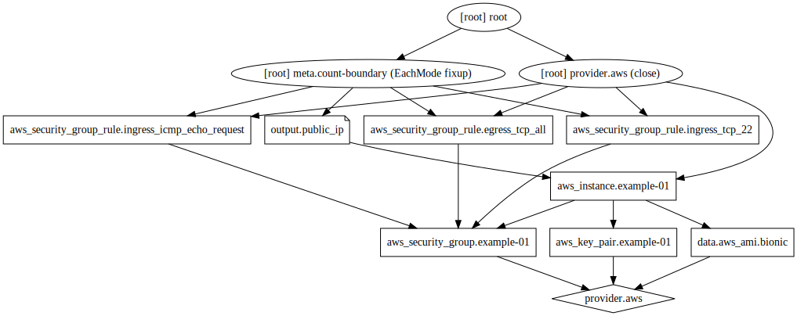

# Verwendung von Abhängigkeiten und Graphen mit Terraform

## Abhängigkeiten

### Implizite Abhängigkeiten

* Werden von Terraform automatisch aufgelöst
* Ergeben die Reihenfolge der Behandlung (Erstellung und Veränderung) von Ressourcen

### Explizite Abhängigkeiten

* Können von Terraform nicht aufgelöst werden
* `depends_on` deklariert eine explizite Abhängigkeit:

```
resource "aws_s3_bucket" "example" {
  bucket = "terraform-getting-started-guide"
  acl    = "private"
}

resource "aws_instance" "example" {
  ami           = "ami-2757f631"
  instance_type = "t2.micro"

  # Tells Terraform that this EC2 instance must be created only after the
  # S3 bucket has been created.
  depends_on = [aws_s3_bucket.example]
}
```

## Graph

* Stellt die Abhängigkeiten dar
* Wird intern benutzt, siehe https://www.terraform.io/docs/internals/graph.html
* Kann durch den Befehl `terraform graph` visualisiert werden

```
terraform graph | dot -Tsvg > graph.svg
```

Plot:



